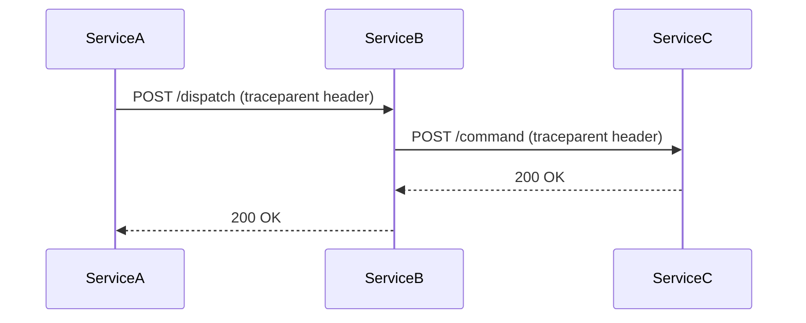
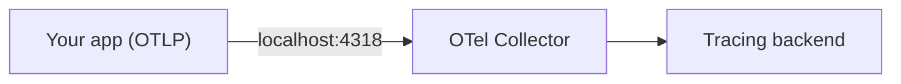

When service A calls service B calls service C, a single request fans out across processes, networks, and log streams. Distributed tracing gives you a unified timeline of that request --- every hop, every latency contribution, every error --- in one view.

<!--more-->

## Core concepts

**Trace** --- a tree of spans sharing a single `trace_id`. One trace = one end-to-end request.

**Span** --- one unit of work (an HTTP handler, an outgoing request, a DB query) with a `span_id`, parent reference, timing, and key-value attributes.

**Context propagation** --- passes `trace_id` + parent `span_id` across process boundaries via the [W3C `traceparent` header](https://www.w3.org/TR/trace-context/). Instrumentation libraries inject the header on outgoing calls and extract it on incoming ones --- no application code touches headers.



## OpenTelemetry setup

[OpenTelemetry](https://opentelemetry.io/) (OTel) is the vendor-neutral instrumentation standard. Your code emits telemetry in OTel format; a separate [collector](#the-collector) decides where it goes (X-Ray, Jaeger, Datadog, ...). Three things to configure:

1. A **`TracerProvider`** with a `Resource` (service name) and an exporter
2. A **`SpanExporter`** --- OTLP to a collector in production, `ConsoleSpanExporter` for local dev
3. **Auto-instrumentors** for your frameworks

```bash
uv add opentelemetry-api opentelemetry-sdk \
       opentelemetry-exporter-otlp-proto-http \
       opentelemetry-instrumentation-fastapi \
       opentelemetry-instrumentation-httpx \
       opentelemetry-instrumentation-requests
```

```python
# src/shared/observability.py
import contextlib
import os

from opentelemetry import trace
from opentelemetry.sdk.resources import SERVICE_NAME, Resource
from opentelemetry.sdk.trace import TracerProvider
from opentelemetry.sdk.trace.export import BatchSpanProcessor, ConsoleSpanExporter, SpanExporter


def init_tracing(service_name: str, *, app=None) -> None:
    otlp_endpoint = os.environ.get("OTEL_EXPORTER_OTLP_ENDPOINT")

    exporter: SpanExporter
    if otlp_endpoint:
        from opentelemetry.exporter.otlp.proto.http.trace_exporter import OTLPSpanExporter
        exporter = OTLPSpanExporter(endpoint=f"{otlp_endpoint}/v1/traces")
    else:
        exporter = ConsoleSpanExporter()

    provider = TracerProvider(resource=Resource.create({SERVICE_NAME: service_name}))
    provider.add_span_processor(BatchSpanProcessor(exporter))
    trace.set_tracer_provider(provider)

    with contextlib.suppress(ImportError):
        from opentelemetry.instrumentation.httpx import HTTPXClientInstrumentor
        HTTPXClientInstrumentor().instrument()

    with contextlib.suppress(ImportError):
        from opentelemetry.instrumentation.requests import RequestsInstrumentor
        RequestsInstrumentor().instrument()

    if app is not None:
        from opentelemetry.instrumentation.fastapi import FastAPIInstrumentor
        FastAPIInstrumentor.instrument_app(app, excluded_urls="health")
```

> [!NOTE]
> `excluded_urls="health"` prevents health-check probes from creating traces. Without it, load-balancer checks pollute the trace map with "Client" nodes.

## FastAPI example

Two services: a **caller** that sends requests and a **server** that handles them. Both call `init_tracing` at startup --- that's all the wiring needed.

**Server** (receives requests, creates server spans automatically):

```python
# server/main.py
from fastapi import FastAPI
from shared.observability import init_tracing

app = FastAPI()
init_tracing("my-server", app=app)

@app.post("/command")
async def handle_command(payload: dict):
    # this handler is automatically wrapped in a span
    result = process(payload)
    return {"status": "ok"}
```

**Caller** (sends requests, injects `traceparent` header automatically):

```python
# caller/main.py
import httpx
from fastapi import FastAPI
from shared.observability import init_tracing

app = FastAPI()
init_tracing("my-caller", app=app)

@app.post("/dispatch")
async def dispatch(payload: dict):
    async with httpx.AsyncClient() as client:
        # httpx auto-instrumentation injects traceparent --- the server
        # sees the same trace_id and creates a child span
        resp = await client.post("http://my-server:8000/command", json=payload)
        return {"upstream_status": resp.status_code}
```

The result: one trace with three spans (caller server span, caller client span, server server span), all linked by the same `trace_id`. No manual header passing, no middleware --- the instrumentors handle it. The same applies if you use `requests` instead of `httpx` --- the `RequestsInstrumentor` in `init_tracing` covers it.

## Manual spans

Auto-instrumentation covers HTTP entry points. For non-HTTP triggers --- a message consumer, a protocol handler, a scheduled job --- create the root span yourself:

```python
tracer = trace.get_tracer(__name__)

def handle_incoming_message(payload):
    with tracer.start_as_current_span("process-message"):
        # any HTTP calls made here automatically become child spans
        dispatch_to_downstream(payload)
```

## Structured logs with trace context

Logs become useful for tracing when they carry `trace_id` and `span_id`. With loguru (see [Logging](../fastapi/logging) for general setup), replace the default sink with a JSON sink that reads the current OTel context:

```python
import json, os, sys
from loguru import logger
from opentelemetry import trace


def _json_sink(message) -> None:
    record = message.record
    ctx = trace.get_current_span().get_span_context()

    trace_id = format(ctx.trace_id, "032x") if ctx.trace_id else "0" * 32
    span_id = format(ctx.span_id, "016x") if ctx.span_id else "0" * 16

    entry = {
        "timestamp": record["time"].strftime("%Y-%m-%dT%H:%M:%S.%fZ"),
        "level": record["level"].name,
        "service": record["extra"].get("service", "unknown"),
        "message": record["message"],
        "trace_id": trace_id,
        "span_id": span_id,
    }
    if record["exception"] is not None:
        entry["exception"] = str(record["exception"])

    sys.stderr.write(json.dumps(entry, default=str) + "\n")
    sys.stderr.flush()


def configure_logging(service_name: str) -> None:
    logger.remove()
    logger.configure(extra={"service": service_name})
    logger.add(_json_sink, level=os.environ.get("LOGURU_LEVEL", "INFO"))
```

Your log aggregator can now group log lines by `trace_id` or link them to the trace timeline.

> [!TIP]
> Some backends (e.g. AWS X-Ray) require an additional field in a backend-specific format to link logs to traces in the UI. Check your backend's docs.

## The collector

Your app should not export traces directly to the tracing backend. Instead, send them over OTLP to a **collector** running alongside it:



The collector handles batching, retry, sampling, and export. Switching backends is a collector config change, not a code change. In a containerized environment (ECS, Kubernetes), run the collector as a **sidecar** and mark it non-essential so telemetry failures never crash your app.

The only config your app needs: `OTEL_EXPORTER_OTLP_ENDPOINT=http://localhost:4318`.

## Async boundaries

Context propagation works over synchronous request-response calls. **Asynchronous boundaries** --- message queues, event streams --- break the trace chain because there is no carrier for the `traceparent` header.

You can bridge them by embedding `traceparent` in the message payload, but that requires schema changes. For most cases, correlating by a **business-level ID** (e.g. `request_id`) across separate traces is simpler.

## Further reading

**OpenTelemetry docs:**
- [Context Propagation](https://opentelemetry.io/docs/concepts/context-propagation) --- how trace context moves across service boundaries
- [Python SDK](https://opentelemetry.io/docs/languages/python/) --- full Python instrumentation guide
- [Python Propagation](https://opentelemetry.io/docs/languages/python/propagation/) --- manual inject/extract when auto-instrumentation isn't enough
- [Python Instrumentation Libraries](https://opentelemetry.io/docs/languages/python/libraries) --- using and discovering auto-instrumentors
- [FastAPI Instrumentation](https://opentelemetry-python-contrib.readthedocs.io/en/latest/instrumentation/fastapi/fastapi.html) --- hooks, excluded URLs, header capture
- [Collector Quick Start](https://opentelemetry.io/docs/collector/quick-start/) --- run the collector in Docker in minutes
- [Collector Configuration](https://opentelemetry.io/docs/collector/configuration) --- receivers, exporters, processors, pipelines

**Specs and standards:**
- [W3C Trace Context](https://www.w3.org/TR/trace-context/) --- the `traceparent` header format

**Backends:**
- [AWS X-Ray with ADOT](https://docs.aws.amazon.com/xray/latest/devguide/xray-otel.html) --- OTel with AWS X-Ray via the AWS Distro for OpenTelemetry
- [ADOT Collector](https://aws-otel.github.io/docs/components/otlp-exporter) --- collector config for AWS backends
- [Jaeger](https://www.jaegertracing.io/) --- open-source tracing backend, good for local development
